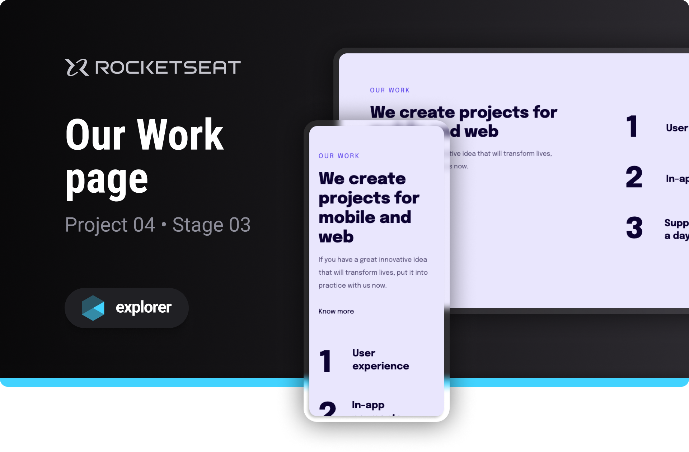

# Our Work page

Project developed on Rocketseat's Explorer course

**Our Work is a landing page designed to learn basic web development concepts**

## 🔗 Project Links

- 🚀 [**Deploy**](https://emanueltavecia.github.io/our-work-page)
- 🎨 [**Figma**](https://www.figma.com/file/DDFFO0Wh6wpOa0LdwNuR0y/Explorer-Stage-03-Projeto-02/duplicate)

## 📋 Project information

- Rocketseat Explorer
- Stage 03
- Project 04

## 🧠 Concepts learned

The development of this project aims to learn the following concepts:

- Introduction to Responsiveness
- Basic CSS styling
  - media queries, flex

## 💻 Technologies

## 📄 License

This project is licensed under the MIT License - see the [LICENSE](./LICENSE) file for more details.
